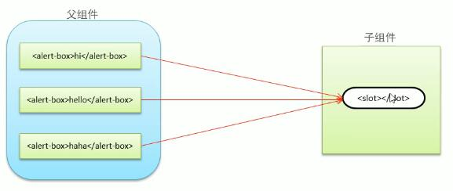

<!--
 * @Descripttion: 
 * @version: 
 * @Author: 唐帆
 * @Date: 2020-05-11 14:27:19
 * @LastEditors: 唐帆
 * @LastEditTime: 2020-05-11 17:47:56
 -->
### 2 组件注册
#### 2.1 全局组件注册语法
```
Vue.component(组件名称, {
    data: 组件数据,
    template: 组件模板内容
})


Vue.component('button-counter', {
    data: function(){
        return {
            count: 0
        }
    },
    template: '<button v-on:click="count++">点击了{{count}}次</button>'
})
```

#### 2.3 组件注册注意事项
##### 1 data 必须是一个函数

##### 2 组件模板内容必须是单个根元素
比如需要两个按钮时：
```
<div>
    <button v-on:click="count++">点击了{{count}}次</button>
    <button v-on:click="count++">点击了{{count}}次</button>
</div>
```

##### 3 组件模板内容可以是模板字符串
模板字符串需要浏览器提供支持（ES6 语法）；

##### 4 组件命名方式
- 大驼峰命名
    - 在调用组件时，依然需要使用短横线的方式来调用
    - 如命名为 HelloWorld，调用时使用 
        ```
        <hello-world></hello-world>
        ```
- 短横线命名

#### 2.4 局部组件注册
```
var ComponentA = {/* ... */}

new Vue({
    el: '#app',
    components: {
        'component-a': ComponentA,
    }
})
```

### 4 组件间数据交互
#### 4.1 父组件向子组件传值
##### 1 组件内内部通过 props 接收传递过来的值
```
Vue.component('menu-item', {
    props: {'title'},
    template: '<div>{{title}}</div>'
})
```
##### 2 父组件通过属性将值传递给子组件
```
<menu-item title="来自父组件的数据"></menu-item>
<menu-item :title="title"></menu-item>
```

##### 3 props 属性名规则
- 在 props 中使用驼峰形式，模板做需要使用短横线形式；
- 在字符串形式的模板中则不受影响；
```
Vue.component('menu-item', {
    props: ['menuTitle'],
    data: function () {
        return {
            msg: '子组件数据'
        }
    },

    template: '<div>{{msg + "-" + menuTitle}}</div>'
})

<menu-item :menu-title="ptitle"></menu-item>
```

#### 4.2 子组件向父组件传值
##### 1 子组件通过自定义事件向父组件传递信息
enlarge-text 是函数名；
```
<button v-on:click='emit("enlarge-text")'>扩大字体</button>
```

##### 2 父组件监听子组件的事件
```
<menu-item v-on:enlarge-text='fontSize += 0.1'></menu-item>
```

#### 4.3 非父子组件间传值
##### 1 单独的事件中心管理组件间的通信
```
var eventHub = new Vue()
```

##### 2 监听事件与销毁事件
```
eventHub.$on('add-todo', addTodo)
eventHub.$off('add-todo')
```

##### 3 触发事件
```
eventHub.$emit('add-todo', id)
```

### 5 组件插槽
用于父组件向子组件传递内容

注意此处的父标签中是有内容的，会将标签中的内容进行传递；

#### 5.2 组件插槽基本用法
##### 1 插槽位置
```
Vue.component('alert-box', {
    template: `
        <div>
            <strong>ERROR:</strong>
            <slot></slot>
        </div>
    `
})
```

##### 2 插槽内容
```
<alert-box>有 warning</alert-box>
```

#### 5.3 具名插槽用法
##### 1 插槽定义
```
<div class="container">
    <header>
        <slot name="header></slot>
    </header>
    <main>
        <slot></slot>
    </main>
    <footer>
        <slot name="footer"></solt>
    </footer>
</div>
```

##### 2 插槽内容
根据名称进行匹配，没有匹配到的放入默认插槽中；
```
<base-layout>
    <h1 slot="header">标题内容</h1>

    <p>主要内容1</p>
    <p>主要内容2</p>

    <p slot="footer">底部内容</p>
</base-layout>

<base-layout>

    <template slot="header">
        <p>标题信息</p>
        <p>标题信息</p>
        <p>标题信息</p>
    </template>

    <p>主要内容</p>
    <p slot="footer">底部信息</p>
</base-layout>
```
- template 是暂时包裹多组标签，可以将多条文本填充到插槽中，并且不会最终添加该 template 标签到页面中；

#### 5.4 作用域插槽
- 应用场景：父组件对子组件的内容进行加工整理

##### 1 插槽定义
```
<ul>
    <li>
        <slot v-bind:item="item">
            {{item.name}}
        </slot>
    </li>
</ul>
```

##### 2 插槽内容
```
<fruit-list v-bind:list="list">
    <template slot-scope="slotProps">
        <strong v-if="slotProps.item.current">
            {{slotProps.item.text}}
        </strong>
    </template>
</fruit-list>
```