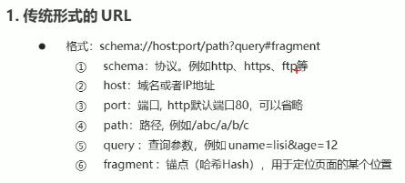
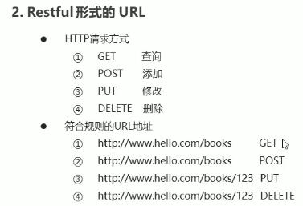

### 1 前后端交互模式
#### 1.2 URL 地址格式




### 3 fetch
#### 3.1 fetch 概述
##### 2 语法结构
```
fetch(url).then(fn2)
          .then(fn3)
          ...
          .catch(fn)
```

#### 3.2 fetch 的基本用法
```
fetch('/abc').then(data => {
    // text 返回一个 promise 实例对象，用于获取后台返回的数据
    return data.text();
}).then(ret => {
    // 注意这里得到的才是最终的数据
    console.log(ret);
})
```

#### 3.3 fetch 请求参数
##### 1 常用配置选项
- method（string）：http 请求方法，默认为 GET，另有 POST、PUT、DELETE；
- body（string）：http 的请求参数；
- headers（Object）：http 的请求头，默认为 0；
```
fetch('/abc', {
    method: 'get'
}).then()
  .then()
  .catch()
```

##### 2 GET 请求传参
```
// 方法 1，传统方式
fetch('/abc?id=123', {
    method: 'get'
}).then(data => {
    // text 返回一个 promise 实例对象，用于获取后台返回的数据
    return data.text();
}).then(ret => {
    // 注意这里得到的才是最终的数据
    console.log(ret);
}).catch()


// 方法 2，restful 方式
// url：/abc/:id
fetch('/abc/123', {
    method: 'get'
}).then(data => {
    // text 返回一个 promise 实例对象，用于获取后台返回的数据
    return data.text();
}).then(ret => {
    // 注意这里得到的才是最终的数据
    console.log(ret);
}).catch()

// 后台接收restful
request.params.id
```


##### 3 DELETE 传参
```
// url：/abc/:id
fetch('/abc/123', {
    method: 'delete'
}).then(data => {
    // text 返回一个 promise 实例对象，用于获取后台返回的数据
    return data.text();
}).then(ret => {
    // 注意这里得到的才是最终的数据
    console.log(ret);
}).catch()

// 后台接收restful
request.params.id
```

##### 4 POST 请求方式的参数传参
###### 1） 一般格式：
```
fetch('/books', {
    method: 'post',
    body: 'uname=lisi&pwd=123',
    headers: {
        'Content-Type': 'application/x-www-form-urlencode',
    }
}).then(data => {
    // text 返回一个 promise 实例对象，用于获取后台返回的数据
    return data.text();
}).then(ret => {
    // 注意这里得到的才是最终的数据
    console.log(ret);
}).catch()

// 后台接收restful
request.body.uname
```

###### 2） json 格式
```
fetch('/books', {
    method: 'post',
    body: JSON.stingify({
        uname: zhangsan
    }),
    headers: {
        'Content-Type': 'application/json',
    }
}).then(data => {
    // text 返回一个 promise 实例对象，用于获取后台返回的数据
    return data.text();
}).then(ret => {
    // 注意这里得到的才是最终的数据
    console.log(ret);
}).catch()

// 后台接收restful
request.body.uname
```

##### 5 PUT 请求
注意：比 post 多在 url 中传递了 id；
```
// url：/abc/:id
fetch('/books/123', {
    method: 'put',
    body: JSON.stingify({
        uname: zhangsan
    }),
    headers: {
        'Content-Type': 'application/json',
    }
}).then(data => {
    // text 返回一个 promise 实例对象，用于获取后台返回的数据
    return data.text();
}).then(ret => {
    // 注意这里得到的才是最终的数据
    console.log(ret);
}).catch()

// 后台接收restful
request.body.uname
request.params.id
```

#### 3.4 fetch 响应结果
##### 响应数据格式
text() ：将返回体处理成字符串类型；
json() ：返回结果和 JSON.parse(responseText) 一致，为 json 格式；
```
// 以 json 格式获取数据
fetch('http://localhost:3000/json').then(function (data) {
    return data.json()
}).then(function (data) {
    console.log(data)
})
```

### 4 axios
- 支持浏览器和 nodejs
- 支持 promise
- 能拦截请求和响应
- 自动转换 JSON

#### 4.2 axios 的基本用法
```
axios.get('/adata')
    .then(ret => {
        // data 属性名称是固定的，用于获取后台响应的数据
        console.log(ret.data)
    })
```

#### 4.3 axios 常用 API
get、post、put、delete

##### 1 GET
- 1 通过 url 传递
    ```
    axios.get('/adata?id=123')
        .then(ret => {
            // data 属性名称是固定的，用于获取后台响应的数据
            console.log(ret.data)
        })

    // 后台接收
    request.query.id

    // restful 方式
    // url：/adata/:id
    axios.get('/adata/123')
        .then(ret => {
            // data 属性名称是固定的，用于获取后台响应的数据
            console.log(ret.data)
        })

    // 后台接收
    request.params.id
    ```

- 2 通过 params 选项传递参数
    ```
    axios.get('/adata', {
        params: {
            id: 123
        }
    })
        .then(ret => {
            // data 属性名称是固定的，用于获取后台响应的数据
            console.log(ret.data)
        })


    // 后台接收
    request.query.id
    ```
    - <strong>更方便；</strong>


##### 2 DELETE
```
axios.delete('/adata?id=123')
    .then(ret => {
        // data 属性名称是固定的，用于获取后台响应的数据
        console.log(ret.data)
    })

// 后台接收
request.query.id


// restful 方式
// url：/adata/:id
axios.delete('/adata/123')
    .then(ret => {
        // data 属性名称是固定的，用于获取后台响应的数据
        console.log(ret.data)
    })

// 后台接收
request.params.id


axios.delete('/adata', {
    params: {
        id: 123
    }
})
    .then(ret => {
        // data 属性名称是固定的，用于获取后台响应的数据
        console.log(ret.data)
    })


// 后台接收
request.query.id
```

##### 3 POST
- 1 通过选项传递参数
    ```
    axios.post('/adata', {
            id: 123
        })
        .then(ret => {
            // data 属性名称是固定的，用于获取后台响应的数据
            console.log(ret.data)
        })
    ```
    - <strong>默认 json 格式</strong>；

- 2 表单形式传递
    - 使用 URLSearchParams 传递（请求头为 x-www-form-urlencode）
    ```
    const params = new URLSearchParams();
    params.append('param1', 'value1');
    params.append('param2', 'value2');
    axios.post('/api/test', params).then(ret => {
        console.log(ret.data)
    })
    ```

##### 4 PUT
```
// url：/adata/:id
axios.put('/adata/123', {
        uname: 'tom'
    })
    .then(ret => {
        // data 属性名称是固定的，用于获取后台响应的数据
        console.log(ret.data)
    })

// 后台接收
request.body.uname
request.params.id
```

#### 4.5 axios 的响应结果
- data 响应返回的数据；
- headers 响应头信息；
- status 响应状态码；
- statusText 响应状态信息；

#### 4.6 axios 的全局配置
- axios.defaults.timeout = 3000; // 超时时间
- axios.defaults.baseURL = 'http://localhost:3000/app'; // 默认地址，或基准地址
    ```
    // 配置请求的基准 URL
    axios.defaults.baseURL = 'http://localhost:3000/'
    // 发起请求自动与 baseURL 进行拼接
    axios.get('axios-json').then(function(ret){
        console.log(ret.data.uname);
    })
    ```
- axios.defaults.headers['mytoken'] = 'asnuion';  // 设置请求头
    - 请求头使用情景：登陆时携带 token；
    - 需要在后台中配置请求头的许可
    ```
    // 配置请求头信息
    axios.defaults.headers['mytoken'] = 'hello';
    ```

#### 4.6 axios 拦截器
##### 1 请求拦截器
在请求发出前设置信息；
可以用于设置请求头；
```
// 添加一个请求拦截器
axios.interceptors.request.use(function(config){
    // 在请求之前进行一些信息设置
    return config
}, function(err){
    // 处理响应的错误信息
})


axios.interceptors.request.use(function (config) {
    console.log(config.url)
    // 配置请求头
    config.headers.mytoken = 'nihao';
    return config;
}, function (err) {
    console.log(err)
})
```

##### 2 响应拦截器
在获取数据之前对数据做一些处理
```
// 添加一个响应拦截器
axios.interceptors.response.use(function(res){
    // 在此对返回的数据进行处理
    // res 是 axios 包装的数据
    return res
}, function(err){
    // 处理响应的错误信息
})
```

### 5 接口调用 async/await 用法
#### 5.1 async/await 的基本用法
- async/await 用于异步操作；
- async 关键字用于函数上；
- await 关键字用于 async 函数中；
```
async function queryData(id) {
    const ret = await axios.get('/data');
    return ret;
}

query.then(ret => {
    console.log(ret);
})
```

#### 5.2 async/await 处理多个异步请求
多个异步请求的场景
```
async function queryData(id) {
    const info = await axios.get('/async1');
    const ret = await axios.get('async2?info=' + info.data);
    return ret;
}

queryData.then(ret => {
    console.log(ret)
})
```